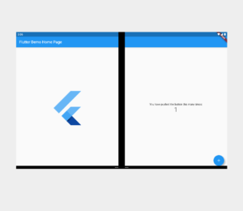

# Surface Duo Flutter samples

This repo contains Flutter samples that incorporate dual-screen enhancements for the Microsoft Surface Duo.

The [starter_sample](https://github.com/microsoft/surface-duo-sdk-samples-flutter/tree/master/starter_sample/) shows how to incorporate the Surface Duo SDK into Flutter so the device info is available in Dart. The [lightup_sample](https://github.com/microsoft/surface-duo-sdk-samples-flutter/tree/master/lightup_sample/) shows how to use the device info to create a layout that adapts to the dual-screen Surface Duo:

Refer the to [dual-screen docs](https://docs.microsoft.com/dual-screen/) for more information and the [Surface Duo emulator download](https://docs.microsoft.com/dual-screen/android/emulator/).

## Adding dual-screen support to an existing app

In addition to the samples in this repo, the [Adding Surface Duo support to the Flokk application blog post](https://devblogs.microsoft.com/surface-duo/adding-microsoft-surface-duo-support-to-the-flokk-application/) is a good reference for adding dual-screen support.

## Contributing

This project welcomes contributions and suggestions.  Most contributions require you to agree to a
Contributor License Agreement (CLA) declaring that you have the right to, and actually do, grant us
the rights to use your contribution. For details, visit https://cla.opensource.microsoft.com.

When you submit a pull request, a CLA bot will automatically determine whether you need to provide
a CLA and decorate the PR appropriately (e.g., status check, comment). Simply follow the instructions
provided by the bot. You will only need to do this once across all repos using our CLA.

This project has adopted the [Microsoft Open Source Code of Conduct](https://opensource.microsoft.com/codeofconduct/).
For more information see the [Code of Conduct FAQ](https://opensource.microsoft.com/codeofconduct/faq/) or
contact [opencode@microsoft.com](mailto:opencode@microsoft.com) with any additional questions or comments.
